# Craft POC

## About

This project is a proof of concept for Craft CMS 3, it will mainly be used as educational tool main to help train new staff on Craft CMS

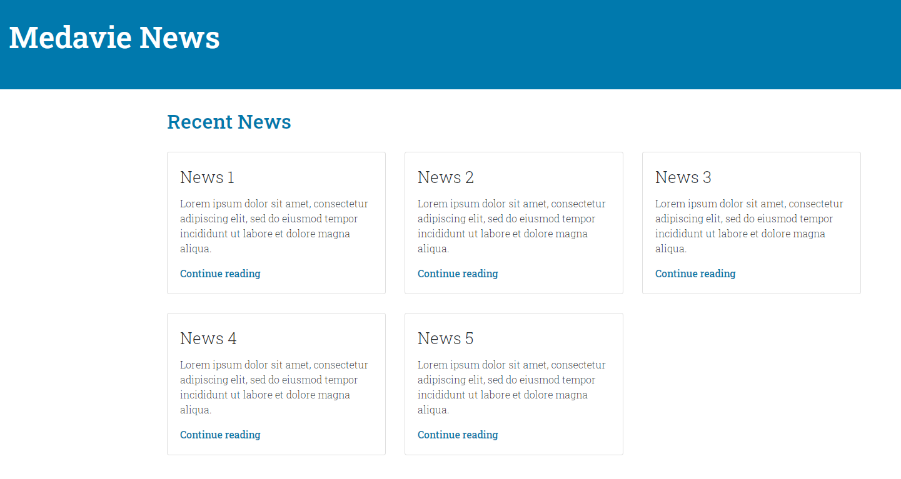

## Prerequisites

You will need the following tools installed: 

* [Visual Studio Code](https://code.visualstudio.com/)
* [Git](https://git-scm.com/downloads)
* [Cmder](https://cmder.net/)
* [MAMP](https://www.mamp.info/en/downloads/)
* [MySQLWorkbench](https://dev.mysql.com/downloads/workbench/)

> I recommend installing the tools under <code>c:/development/tools</code> to avoid issues with Carbon Black and Mcafee

## Installation

### Downloading the project

1. Create the folder <code>c:/development/projects</code>

2. Open <strong>Cmder</strong> and run the following command:

```sh
cd c:/development/projects
```
3. Download the Craft POC project by running the following command :

```sh
git clone https://github.com/medavie/craft-poc
```
### Configuring the web server

1. Open <strong>MAMP</strong> and click on the <strong>MAMP > Preferences</strong> menu

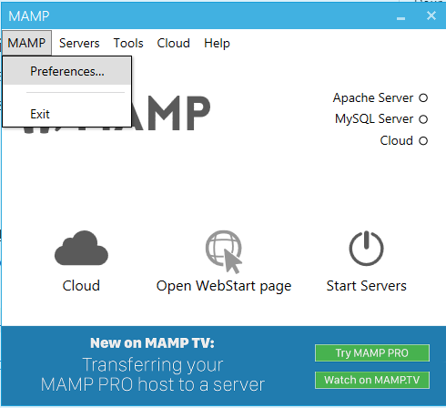

2. On the <strong>Web Server</strong> tab, click the <strong>Select</strong> button.

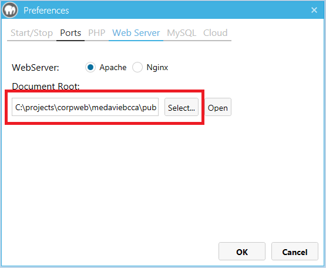

3. Select the <code>C:/development/projects/craft-poc/web</code> folder and click the <strong>OK</strong> button.

4. On the <strong>PHP</strong> tab, take note of the <strong>Standard version</strong>. You will need it in the next step.

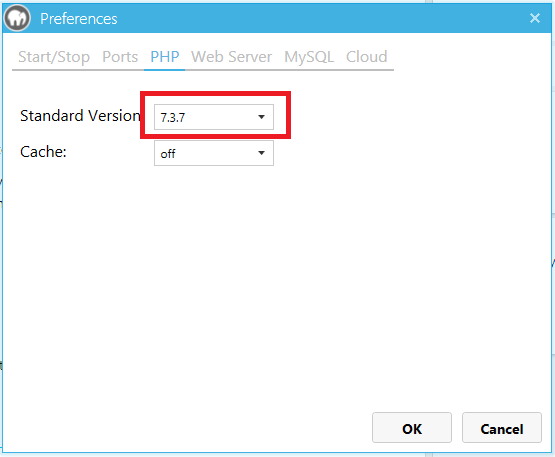

5. In <strong>Windows File Exporer</strong>, open <code>%MAMP_INSTALLATION_DIRECTORY%/conf/%PHP_VERSION%/php.ini</code>

6. Inside the <strong>php.ini</strong> file, search for <code>extension=php_pdo_mysql.dll</code>.

7. Below the <code>extension=php_pdo_mysql.dll</code> line, add <code>extension=php_fileinfo.dll</code>

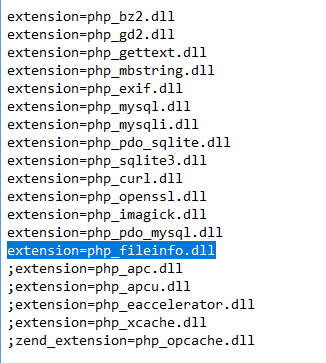

8. On <strong>MAMP</strong>, click the <strong>Start Servers</strong> button.

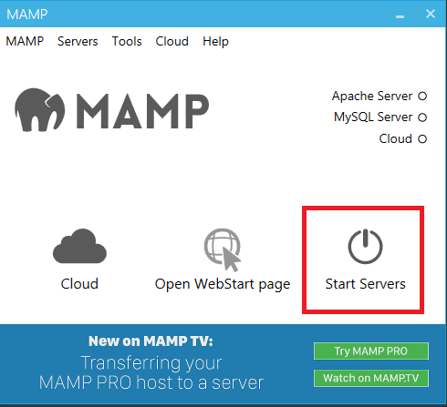

### Setting up the database

1. Open <strong>MySQLWorkbench</strong> and create a new connection by clicking the plus sign

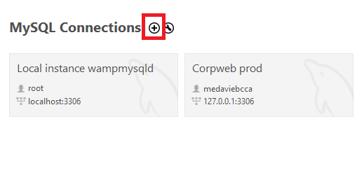

2. On the <strong>Setup New Dialog</strong>, enter the following:

* <strong>Connection Name:</strong> Craft-POC
* <strong>Hostname:</strong> 127.0.0.1
* <strong>Port:</strong> 3306
* <strong>Username</strong>: root

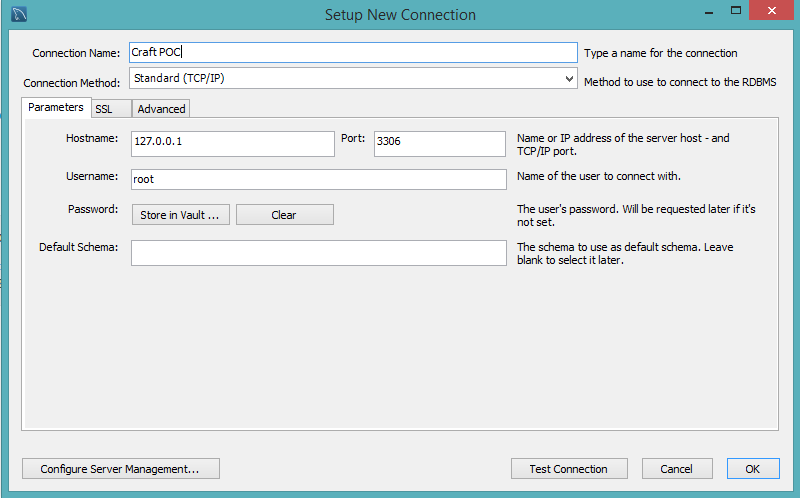

3. On the <strong>Setup New Dialog</strong>, click the <strong>Store in vault...</strong> button and enter the following:

* <strong>Password:</strong> root

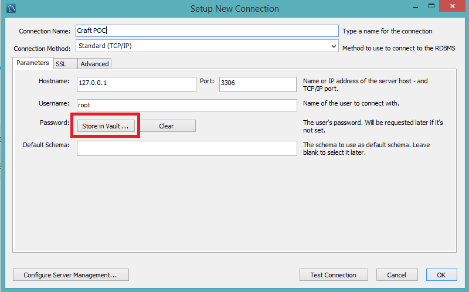

4. Click on the <strong>Test connection</strong> button. If the connection succeeds, click the <strong>Ok</strong> button.

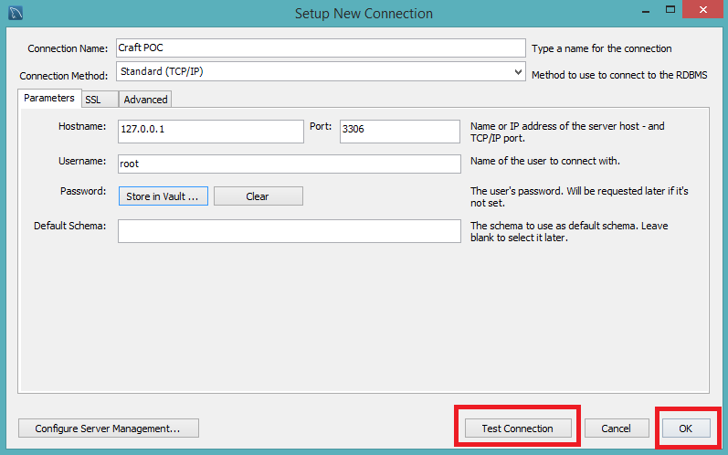

5. Click on the newly created connection.

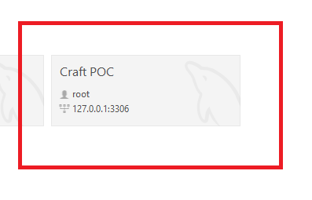

6. Click on the <strong>Server > Data Import</strong> menu.

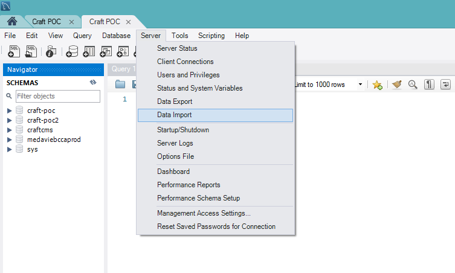

7. On the <strong>Data Import</strong> dialog, do the following:

* Click on the <strong>Import from Self-Imported File</strong> radio button. 
* Select the <code>c:/development/projects/craft-poc/data/data.sql</code> file
* Click on the <strong>New</strong> button.

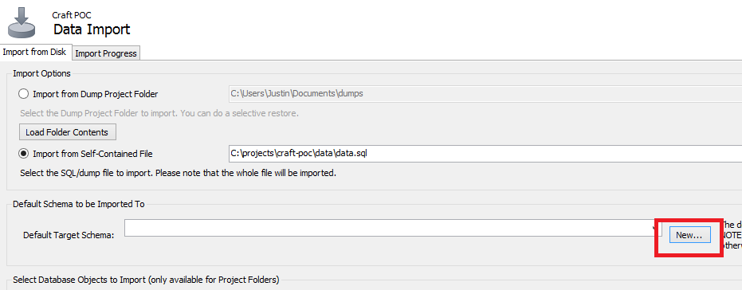

8. On the <strong>Create Schema</strong> dialog, enter the following and click the <strong>OK</strong> button:

* <strong>Name of schema to create:</strong> craft-poc

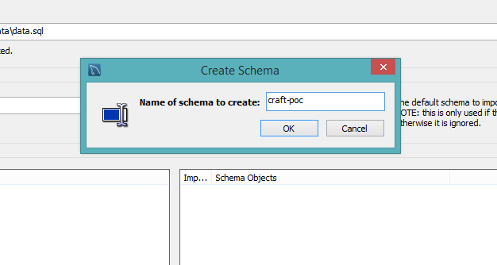

9. On the <strong>Data Import</strong> dialog, click the <strong>Start Import</strong> button. 

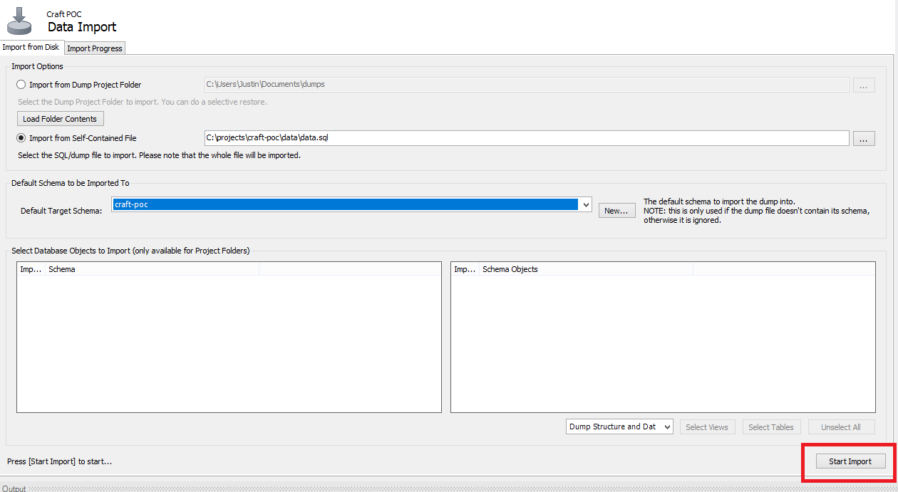


## Accesing the website

1. Open your browser and enter <strong>http://localhost</strong> in URL. 

2. You should now see the following appearing:


## Updating the website

1. Open your browser and enter http://localhost/admin/login in the URL.

2. Enter the following information and click the <strong>Login</strong> button.

* <strong>Username:</strong> craft-user
* <strong>Password:<strong> testtest

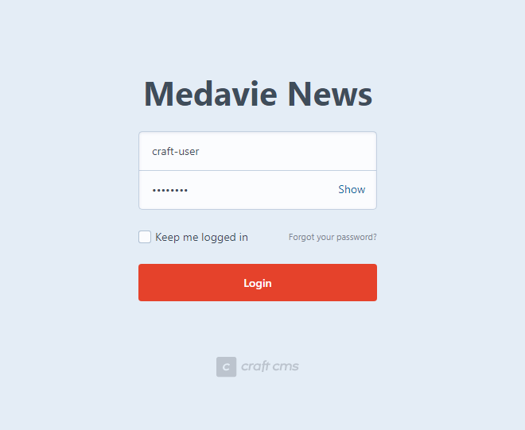

3. You should now see the following appearing:

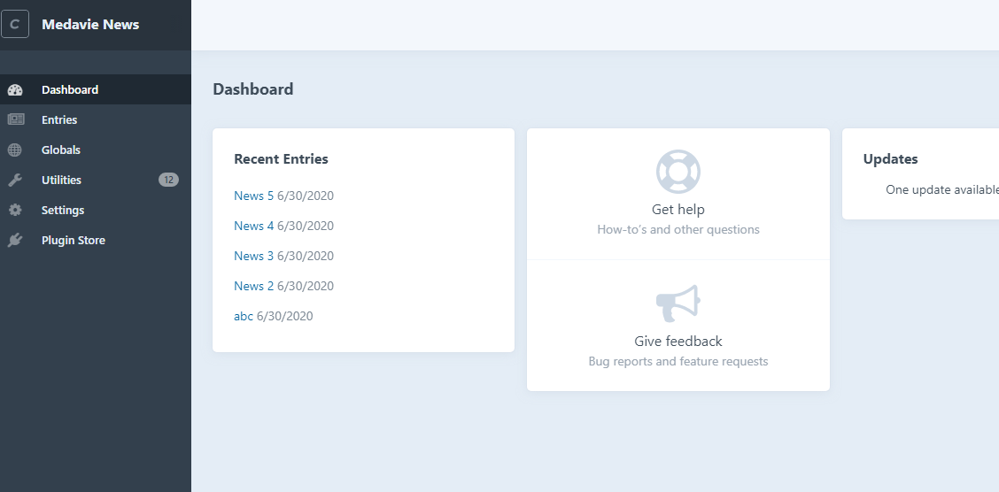

